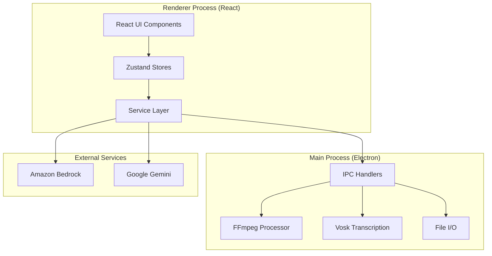
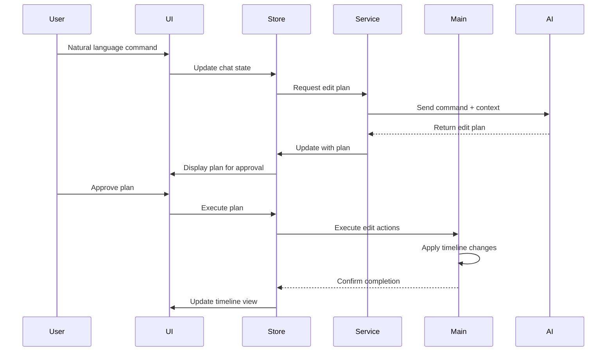
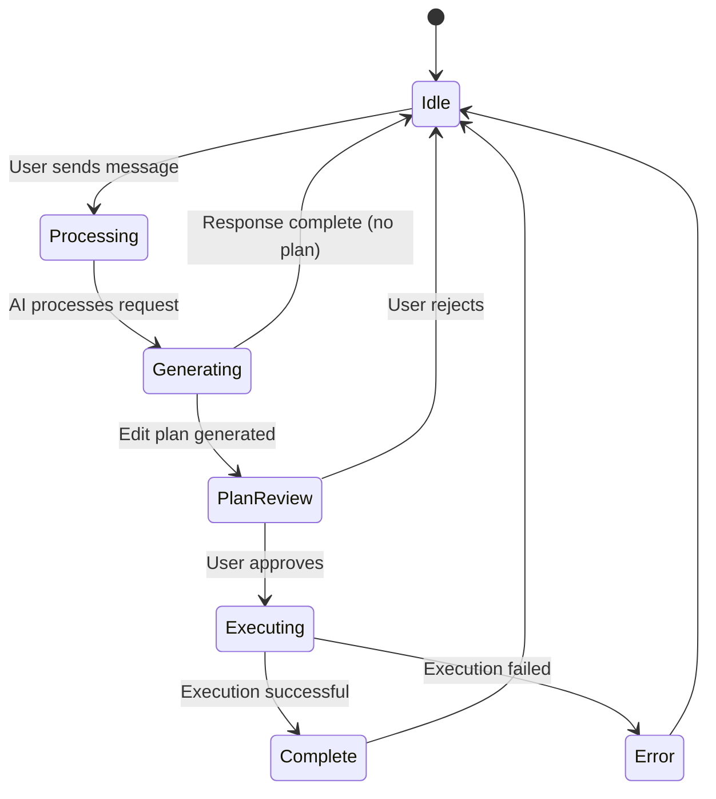

# Design Document: QuickCut AI Video Editor

## Overview

QuickCut is an AI-native desktop video editor built with Electron, React, and TypeScript that enables creators to edit videos through natural language commands and intelligent automation. The system's core differentiator is its agentic AI that executes real timeline edits using the same tools available to manual users, rather than just suggesting edits. The application operates in a local-first, privacy-focused environment with AI reasoning enhancement through Amazon Bedrock.

The architecture follows a clear separation between the Electron main process (handling FFmpeg operations, file I/O, and AI services) and the React renderer process (managing UI, state, and user interactions). State management uses Zustand stores with project-specific memory persistence.

## Architecture

### High-Level Architecture



### Component Architecture

The application is structured into distinct layers:

1. **Presentation Layer** (React Components)
   - Timeline: Multi-track editing interface with drag-and-drop
   - Preview: Real-time video preview with playback controls
   - Chat Interface: Conversational AI interaction panel
   - Media Library: Asset management and organization
   - Settings: Configuration and preferences

2. **State Management Layer** (Zustand Stores)
   - ProjectStore: Timeline state, clips, playback
   - ChatStore: AI conversation history and context
   - MemoryStore: Creator memory and media analysis
   - ProfileStore: User preferences and settings

3. **Service Layer**
   - AIService: Bedrock integration for edit planning
   - AnalysisService: Gemini integration for media analysis
   - TranscriptionService: Vosk integration for speech-to-text
   - ExportService: FFmpeg integration for video rendering

4. **Main Process Layer** (Electron)
   - IPC handlers for cross-process communication
   - FFmpeg operations for media processing
   - File system operations for project persistence
   - Native OS integrations

### Data Flow



## Components and Interfaces

### 1. Agentic AI System

#### Edit Action Library

The Edit Action Library defines atomic operations that the AI can execute on the timeline. Each action is a JSON-serializable command with validation and rollback support.

```typescript
interface EditAction {
  type: 'cut' | 'trim' | 'split' | 'merge' | 'add_effect' | 'add_transition' | 'adjust_audio' | 'add_text' | 'move' | 'delete';
  targetClipId?: string;
  targetTrackIndex?: number;
  parameters: Record<string, any>;
  timestamp: number;
}

interface EditPlan {
  id: string;
  description: string;
  actions: EditAction[];
  estimatedDuration: number;
  requiresApproval: boolean;
  createdAt: number;
}
```

Action types and their parameters:

- **cut**: `{ clipId, startTime, endTime }` - Remove a segment from a clip
- **trim**: `{ clipId, newStart?, newEnd? }` - Adjust clip boundaries
- **split**: `{ clipId, splitTime }` - Split clip into two at specified time
- **merge**: `{ clipIds }` - Combine multiple clips into one
- **add_effect**: `{ clipId, effectType, parameters }` - Apply visual/audio effect
- **add_transition**: `{ clipId1, clipId2, transitionType, duration }` - Add transition between clips
- **adjust_audio**: `{ clipId, volume?, fadeIn?, fadeOut?, mute? }` - Modify audio properties
- **add_text**: `{ trackIndex, startTime, duration, textProperties }` - Add text overlay
- **move**: `{ clipId, newStartTime, newTrackIndex? }` - Reposition clip on timeline
- **delete**: `{ clipId }` - Remove clip from timeline

#### AI Edit Planner

The AI Edit Planner converts natural language commands into structured edit plans using Amazon Bedrock.

```typescript
interface AIEditPlanner {
  generatePlan(
    command: string,
    timelineContext: TimelineContext,
    creatorMemory: CreatorMemoryContext
  ): Promise<EditPlan>;
  
  validatePlan(plan: EditPlan): ValidationResult;
  executePlan(plan: EditPlan, onProgress: ProgressCallback): Promise<ExecutionResult>;
  cancelExecution(planId: string): Promise<void>;
}

interface TimelineContext {
  clips: Clip[];
  totalDuration: number;
  currentTime: number;
  selectedClips: string[];
}

interface CreatorMemoryContext {
  stylePatterns: StylePattern[];
  commonTransitions: string[];
  preferredMusic: string[];
  pacingPreferences: PacingPreferences;
}
```

The planner uses a multi-step process:

1. **Parse Command**: Extract intent and parameters from natural language
2. **Analyze Context**: Consider current timeline state and creator memory
3. **Generate Actions**: Create sequence of edit actions
4. **Validate Plan**: Check for conflicts and feasibility
5. **Present for Approval**: Display plan to user with action details
6. **Execute**: Apply actions sequentially with progress tracking

#### AI Service Integration

```typescript
interface BedrockService {
  sendCommand(
    prompt: string,
    context: AIContext,
    options: BedrockOptions
  ): Promise<BedrockResponse>;
  
  streamResponse(
    prompt: string,
    context: AIContext,
    onChunk: (chunk: string) => void
  ): Promise<void>;
}

interface AIContext {
  timelineState: TimelineContext;
  creatorMemory: CreatorMemoryContext;
  conversationHistory: ChatMessage[];
  availableActions: EditAction[];
}

interface BedrockOptions {
  model: 'claude-3-5-sonnet' | 'llama-3-70b';
  temperature: number;
  maxTokens: number;
  cacheContext: boolean;
}
```

### 2. Creator Memory System

#### Memory Storage

Creator memory is stored project-specifically and persists with the project file.

```typescript
interface MediaAnalysisEntry {
  id: string;
  filePath: string;
  fileName: string;
  clipId?: string;
  mediaType: 'video' | 'audio' | 'image';
  mimeType: string;
  duration?: number;
  status: 'pending' | 'analyzing' | 'completed' | 'failed';
  analysis: string;
  summary: string;
  tags: string[];
  visualInfo?: VisualInfo;
  audioInfo?: AudioInfo;
  scenes?: Scene[];
  createdAt: number;
  updatedAt: number;
}

interface VisualInfo {
  subjects: string[];
  style: string;
  dominantColors: string[];
  composition: string;
  quality: string;
}

interface AudioInfo {
  hasSpeech: boolean;
  hasMusic: boolean;
  languages: string[];
  mood: string;
  transcriptSummary?: string;
}

interface Scene {
  startTime: number;
  endTime: number;
  description: string;
}
```

#### Channel Analysis

The system analyzes a creator's existing YouTube channel to learn patterns.

```typescript
interface ChannelAnalysisService {
  analyzeChannel(channelUrl: string): Promise<AnalysisResult>;
  getUserAnalysis(userId: string): AnalysisResult | null;
  linkAnalysisToUser(userId: string, channelUrl: string): Promise<boolean>;
}

interface AnalysisResult {
  channel: ChannelMetadata;
  stylePatterns: StylePattern[];
  contentThemes: string[];
  editingPatterns: EditingPattern[];
  audienceInsights: AudienceInsights;
}

interface StylePattern {
  type: 'pacing' | 'transitions' | 'effects' | 'music';
  frequency: number;
  examples: string[];
  confidence: number;
}

interface EditingPattern {
  averageClipDuration: number;
  cutsPerMinute: number;
  commonTransitions: string[];
  effectUsage: Record<string, number>;
}
```

#### Memory Context Generation

```typescript
interface MemoryContextGenerator {
  getMemoryContext(): GeminiMemoryContext;
  getMemoryContextString(): string;
  updateMemoryFromEdit(edit: EditAction): void;
}

interface GeminiMemoryContext {
  totalFiles: number;
  projectSummary: string;
  entries: MediaAnalysisEntry[];
}
```

### 3. Timeline System

#### Timeline State Management

```typescript
interface TimelineState {
  clips: Clip[];
  tracks: Track[];
  currentTime: number;
  isPlaying: boolean;
  zoom: number;
  snapToGrid: boolean;
  gridSize: number;
}

interface Clip {
  id: string;
  path: string;
  name: string;
  duration: number;
  sourceDuration: number;
  start: number;
  end: number;
  startTime: number;
  trackIndex: number;
  thumbnail?: string;
  waveform?: string;
  mediaType: 'video' | 'audio' | 'image' | 'text';
  volume: number;
  muted: boolean;
  locked: boolean;
  segments?: ClipSegment[];
  isMerged?: boolean;
  textProperties?: TextProperties;
  fadeIn?: number;
  fadeOut?: number;
}

interface Track {
  id: string;
  index: number;
  type: 'video' | 'audio';
  name: string;
  locked: boolean;
  muted: boolean;
  solo: boolean;
}
```

#### Timeline Operations

```typescript
interface TimelineOperations {
  addClip(clip: Omit<Clip, 'id'>): string;
  removeClip(clipId: string): void;
  moveClip(clipId: string, newStartTime: number, newTrackIndex?: number): void;
  splitClip(clipId: string, splitTime: number): [string, string];
  mergeClips(clipIds: string[]): string;
  trimClip(clipId: string, newStart?: number, newEnd?: number): void;
  updateClip(clipId: string, updates: Partial<Clip>): void;
  undo(): void;
  redo(): void;
}
```

#### Multi-Track Management

The timeline supports 10 video tracks (indices 0-9) and 10 audio tracks (indices 10-19). Clips on lower-indexed video tracks appear on top in the final render.

```typescript
interface TrackManager {
  getTracksAtTime(time: number): Clip[];
  getTopVideoClipAtTime(time: number): Clip | null;
  getAudioClipsAtTime(time: number): Clip[];
  autoAssignTrack(clip: Clip): number;
  validateTrackPlacement(clip: Clip, trackIndex: number): boolean;
}
```

### 4. Transcription and Edit-by-Text

#### Vosk Integration

```typescript
interface TranscriptionService {
  transcribeVideo(videoPath: string, onProgress: ProgressCallback): Promise<TranscriptionResult>;
  transcribeTimeline(clips: Clip[], onProgress: ProgressCallback): Promise<TranscriptionResult>;
  downloadLanguageModel(language: string): Promise<void>;
}

interface TranscriptionResult {
  text: string;
  segments: TranscriptSegment[];
  words: TranscriptWord[];
}

interface TranscriptSegment {
  id: number;
  start: number;
  end: number;
  text: string;
  confidence: number;
}

interface TranscriptWord {
  word: string;
  start: number;
  end: number;
  confidence: number;
}
```

#### Transcript Editing

```typescript
interface TranscriptEditor {
  applyDeletions(deletionRanges: TimeRange[]): Promise<void>;
  searchTranscript(query: string): TranscriptMatch[];
  exportAsSubtitles(format: 'srt' | 'vtt'): string;
}

interface TimeRange {
  start: number;
  end: number;
}

interface TranscriptMatch {
  segmentId: number;
  wordIndex: number;
  matchText: string;
  timelinePosition: number;
}
```

When a user deletes text from the transcript, the system:

1. Identifies the time range corresponding to deleted words
2. Applies padding and merging based on transcript edit settings
3. Removes or trims clips in that time range
4. Optionally applies crossfades for smooth transitions
5. Updates the timeline state

### 5. Media Processing Pipeline

#### FFmpeg Integration

```typescript
interface FFmpegProcessor {
  getMetadata(filePath: string): Promise<MediaMetadata>;
  generateThumbnail(filePath: string, timestamp?: number): Promise<string>;
  generateWaveform(filePath: string): Promise<string>;
  generateProxy(filePath: string, resolution: string): Promise<string>;
  exportVideo(
    clips: Clip[],
    outputPath: string,
    options: ExportOptions,
    onProgress: ProgressCallback
  ): Promise<void>;
}

interface MediaMetadata {
  duration: number;
  format: string;
  width: number;
  height: number;
  hasVideo: boolean;
  hasAudio: boolean;
  codec: string;
  bitrate: number;
  frameRate: number;
}

interface ExportOptions {
  format: 'mp4' | 'mov' | 'avi' | 'webm';
  resolution: '1920x1080' | '1280x720' | '854x480' | 'original';
  codec: string;
  bitrate: string;
  frameRate: number;
  subtitles?: SubtitleEntry[];
  subtitleStyle?: SubtitleStyle;
}
```

#### Proxy Workflow

For high-resolution media, the system automatically generates lower-resolution proxies for editing:

1. On import, detect if media exceeds 1080p resolution
2. Generate 720p proxy in background using FFmpeg
3. Use proxy for timeline preview and editing
4. Switch to original media during export

```typescript
interface ProxyManager {
  shouldGenerateProxy(metadata: MediaMetadata): boolean;
  generateProxy(filePath: string): Promise<string>;
  getProxyPath(originalPath: string): string;
  cleanupProxies(projectId: string): Promise<void>;
}
```

#### Performance Optimization

```typescript
interface PerformanceManager {
  adjustPreviewQuality(frameRate: number): void;
  enableHardwareAcceleration(): boolean;
  optimizeRenderPipeline(clips: Clip[]): RenderPipeline;
  monitorResourceUsage(): ResourceMetrics;
}

interface ResourceMetrics {
  cpuUsage: number;
  memoryUsage: number;
  gpuUsage: number;
  diskIO: number;
}
```

### 6. Project Persistence

#### Project File Format

Projects are saved as JSON files with `.quickcut` extension.

```typescript
interface ProjectFile {
  version: string;
  projectId: string;
  clips: Clip[];
  activeClipId: string | null;
  selectedClipIds: string[];
  currentTime: number;
  subtitles: SubtitleEntry[];
  subtitleStyle: SubtitleStyle;
  memory: MediaAnalysisEntry[];
  chat: ChatData;
  settings: ProjectSettings;
}

interface ChatData {
  messages: ChatMessage[];
  sessionTokens: TokenStats;
}

interface ProjectSettings {
  exportFormat: ExportFormat;
  exportResolution: ExportResolution;
  snapToGrid: boolean;
  gridSize: number;
  autoSaveEnabled: boolean;
  autoSaveInterval: number;
  defaultImageDuration: number;
}
```

#### Auto-Save System

```typescript
interface AutoSaveManager {
  enable(): void;
  disable(): void;
  setInterval(seconds: number): void;
  performAutoSave(): Promise<void>;
  recoverLastSession(): Promise<ProjectFile | null>;
}
```

Auto-save triggers:
- Every N seconds (configurable, default 120s)
- Before executing AI edit plans
- Before export operations
- On application quit (if unsaved changes)

### 7. Chat Interface

#### Chat State Management

```typescript
interface ChatState {
  messages: ChatMessage[];
  isOpen: boolean;
  isTyping: boolean;
  context: ChatContext;
  sessionTokens: TokenStats;
  autoExecute: boolean;
}

interface ChatMessage {
  id: string;
  role: 'user' | 'assistant' | 'system';
  content: string;
  timestamp: number;
  metadata?: MessageMetadata;
  attachments?: MediaAttachment[];
  tokens?: TokenInfo;
}

interface MessageMetadata {
  editPlan?: EditPlan;
  executionResult?: ExecutionResult;
  error?: string;
}

interface MediaAttachment {
  id: string;
  fileName: string;
  mimeType: string;
  size: number;
  previewUrl?: string;
}
```

#### Conversation Flow



## Data Models

### Core Data Structures

#### Clip Model

```typescript
interface Clip {
  // Identity
  id: string;
  path: string;
  name: string;
  
  // Timing
  duration: number;          // Effective duration on timeline
  sourceDuration: number;    // Original file duration
  start: number;             // Trim start in source
  end: number;               // Trim end in source
  startTime: number;         // Position on timeline
  
  // Track placement
  trackIndex: number;        // 0-9 video, 10-19 audio
  
  // Media properties
  mediaType: 'video' | 'audio' | 'image' | 'text';
  thumbnail?: string;        // Base64 thumbnail
  waveform?: string;         // Base64 waveform
  
  // Audio properties
  volume: number;            // 0-1
  muted: boolean;
  fadeIn?: number;           // Seconds
  fadeOut?: number;          // Seconds
  
  // State
  locked: boolean;
  
  // Merged clips
  segments?: ClipSegment[];
  isMerged?: boolean;
  
  // Text clips
  textProperties?: TextProperties;
}
```

#### Edit Action Model

```typescript
interface EditAction {
  type: ActionType;
  targetClipId?: string;
  targetTrackIndex?: number;
  parameters: ActionParameters;
  timestamp: number;
  undoData?: any;
}

type ActionType = 
  | 'cut'
  | 'trim'
  | 'split'
  | 'merge'
  | 'add_effect'
  | 'add_transition'
  | 'adjust_audio'
  | 'add_text'
  | 'move'
  | 'delete';

type ActionParameters = 
  | CutParameters
  | TrimParameters
  | SplitParameters
  | MergeParameters
  | EffectParameters
  | TransitionParameters
  | AudioParameters
  | TextParameters
  | MoveParameters
  | DeleteParameters;
```

#### Memory Entry Model

```typescript
interface MediaAnalysisEntry {
  // Identity
  id: string;
  filePath: string;
  fileName: string;
  clipId?: string;
  
  // Media info
  mediaType: 'video' | 'audio' | 'image';
  mimeType: string;
  duration?: number;
  
  // Analysis
  status: 'pending' | 'analyzing' | 'completed' | 'failed';
  analysis: string;
  summary: string;
  tags: string[];
  
  // Detailed analysis
  visualInfo?: VisualInfo;
  audioInfo?: AudioInfo;
  scenes?: Scene[];
  
  // Timestamps
  createdAt: number;
  updatedAt: number;
  
  // Error handling
  error?: string;
}
```

### Database Schema

The application uses file-based storage with JSON serialization. No traditional database is required.

**Project Files** (`.quickcut`):
- Location: User-specified directory
- Format: JSON
- Contains: Complete project state including clips, memory, chat

**Memory Files** (`.md`):
- Location: `~/.quickcut/memory/projects/{projectId}/analyses/`
- Format: Markdown
- Contains: Human-readable analysis reports

**Cache Files**:
- Location: `~/.quickcut/cache/`
- Format: JSON
- Contains: Channel analysis cache, proxy media references

## Correctness Properties

*A property is a characteristic or behavior that should hold true across all valid executions of a system—essentially, a formal statement about what the system should do. Properties serve as the bridge between human-readable specifications and machine-verifiable correctness guarantees.*

Before defining the correctness properties, I need to analyze the acceptance criteria from the requirements document to determine which are testable as properties, examples, or edge cases.


### Correctness Properties

Based on the prework analysis and property reflection, the following properties validate the system's correctness:

#### AI Command Processing Properties

Property 1: Edit Plan Generation
*For any* natural language editing command, the Agentic_AI should generate a valid Edit_Plan with a non-empty list of Edit_Actions
**Validates: Requirements 1.1**

Property 2: Sequential Action Execution
*For any* Edit_Plan with multiple actions, when approved and executed, each Edit_Action should execute in the order specified in the plan
**Validates: Requirements 1.3**

Property 3: Execution Halt on Failure
*For any* Edit_Plan execution where an Edit_Action fails, execution should halt immediately and no subsequent actions should execute
**Validates: Requirements 1.5**

Property 4: State Update on Completion
*For any* successfully completed Edit_Plan, the Project_State should reflect all changes from the executed actions
**Validates: Requirements 1.6**

Property 5: Cancellation Preserves State
*For any* executing Edit_Plan, when cancelled, the Timeline state should match the state before the cancelled action began
**Validates: Requirements 1.8**

#### Creator Memory Properties

Property 6: Memory Context Inclusion
*For any* Edit_Plan generation request, the AI service call should include Creator_Memory context in the request payload
**Validates: Requirements 2.3**

Property 7: Memory Update on Edit Completion
*For any* completed edit operation, the Creator_Memory should contain at least one new or updated pattern entry
**Validates: Requirements 2.4**

Property 8: Local-First Media Guarantee
*For any* system operation involving media files, AI requests, or transcription, no network request should contain media file binary data
**Validates: Requirements 2.5, 8.1, 8.4, 18.3**

#### Timeline Operation Properties

Property 9: Clip Placement Accuracy
*For any* media added to the Timeline with a specified track and playhead position, the resulting clip should appear at exactly that track index and start time
**Validates: Requirements 3.2**

Property 10: Frame-Accurate Positioning
*For any* clip drag operation to a new timeline position, the clip's startTime should be set to the exact frame boundary nearest the drop position
**Validates: Requirements 3.3**

Property 11: Split Creates Two Clips
*For any* clip split operation at a valid position, the result should be exactly two clips whose combined duration equals the original clip duration
**Validates: Requirements 3.5**

Property 12: Trim Isolation
*For any* clip trim operation, all other clips on the timeline should have identical start times, end times, and durations before and after the trim
**Validates: Requirements 3.6**

Property 13: Undo/Redo Round Trip
*For any* timeline state, performing an operation followed by undo followed by redo should result in a timeline state equivalent to after the original operation
**Validates: Requirements 3.9**

#### Transcript Editing Properties

Property 14: Transcript Generation Completeness
*For any* video file with audio content, transcription should produce a TranscriptionResult with at least one segment and word-level timestamps for each word
**Validates: Requirements 4.1**

Property 15: Text Deletion Removes Segments
*For any* text deletion from the transcript, all timeline clips whose time ranges overlap with the deleted text's time range should be removed or trimmed
**Validates: Requirements 4.2**

Property 16: Search Navigation Accuracy
*For any* transcript search query that matches text, navigating to a match should set the timeline currentTime to the start time of the matched segment
**Validates: Requirements 4.3**

#### Media Pipeline Properties

Property 17: Proxy Generation for High-Res Media
*For any* imported media file with resolution greater than 1920x1080, a proxy media file should be generated automatically
**Validates: Requirements 5.1**

Property 18: Export Uses Original Media
*For any* project export where proxy media was used during editing, the exported video should be rendered from the original high-resolution source files
**Validates: Requirements 5.4**

#### AI Service Properties

Property 19: Response Caching
*For any* AI request with identical prompt and context sent twice, the second request should return a cached response without making an external API call
**Validates: Requirements 6.5**

Property 20: Exponential Backoff Retry
*For any* failed AI request, the system should retry up to 3 times with exponentially increasing delays between attempts
**Validates: Requirements 6.6**

Property 21: AI Request Rate Limiting
*For any* sequence of AI requests within a 60-second window, the total number of requests should not exceed 10
**Validates: Requirements 6.10, 22.6**

#### AI Safety Properties

Property 22: Destructive Action Confirmation
*For any* Edit_Action classified as destructive (delete, cut with data loss), user confirmation should be required before execution
**Validates: Requirements 7.1**

Property 23: Parameter Validation Before Execution
*For any* Edit_Action in an Edit_Plan, all parameters should pass validation checks before the action is applied to the timeline
**Validates: Requirements 7.2, 19.2**

Property 24: File Access Boundary
*For any* file system operation initiated by the AI or user, the file path should resolve to a location within the project directory
**Validates: Requirements 7.3**

Property 25: Input Sanitization
*For any* user input sent to AI services, dangerous patterns (SQL injection, command injection, script tags) should be removed or escaped
**Validates: Requirements 7.4**

#### Project Persistence Properties

Property 26: Project Save/Load Round Trip
*For any* project state, saving to a file and then loading from that file should restore a project state equivalent to the original
**Validates: Requirements 10.1, 10.2**

Property 27: JSON Format Validity
*For any* saved project file, the file contents should be valid JSON and parseable without errors
**Validates: Requirements 10.6**

#### Media Library Properties

Property 28: Metadata Extraction Completeness
*For any* imported media file, the Media_Library entry should contain metadata fields for duration, resolution, codec, and frame rate
**Validates: Requirements 12.2**

Property 29: Search Result Relevance
*For any* Media_Library search query, all returned results should have at least one field (filename, tag, or metadata) that matches the query string
**Validates: Requirements 12.3**

#### Effects and Export Properties

Property 30: Transition Placement
*For any* two adjacent clips on the same track, applying a transition should create a transition object positioned between the clips' time boundaries
**Validates: Requirements 13.2**

Property 31: Export Preset Configuration
*For any* export preset selection, the export settings should match the preset's defined resolution, bitrate, and codec values
**Validates: Requirements 14.2**

Property 32: Range Export Accuracy
*For any* timeline range selection for export, the exported video duration should equal the selected range duration
**Validates: Requirements 14.6**

#### Error Recovery Properties

Property 33: Auto-Save on Critical Error
*For any* critical error that triggers application termination, an auto-save operation should complete before the process exits
**Validates: Requirements 16.2**

Property 34: Crash Recovery Offer
*For any* application restart following a crash where auto-save occurred, the user should be presented with a recovery option
**Validates: Requirements 16.3**

#### Edit Action Properties

Property 35: Action Undo Recording
*For any* executed Edit_Action, the undo history should contain an entry that can restore the state before the action
**Validates: Requirements 19.3**

Property 36: Atomic Rollback on Failure
*For any* Edit_Action that fails during execution, the timeline state should match the state immediately before the action began
**Validates: Requirements 19.4**

Property 37: Transactional Action Chains
*For any* sequence of chained Edit_Actions, if any action fails, all previously executed actions in the chain should be rolled back
**Validates: Requirements 19.5**

#### Chat Interface Properties

Property 38: Immediate Message Display
*For any* user message sent through the chat interface, the message should appear in the chat history within 100ms
**Validates: Requirements 20.2**

Property 39: Streaming Response Display
*For any* AI response, text chunks should appear progressively in the chat interface as they are received
**Validates: Requirements 20.3**

Property 40: Plan Execution from Chat
*For any* Edit_Plan approved through the chat interface, the plan's actions should execute on the timeline
**Validates: Requirements 20.6**

#### Performance Properties

Property 41: AI Command Response Time
*For any* AI command under normal system load, the response should be received within 3 seconds
**Validates: Requirements 21.1**

Property 42: Timeline Playback Frame Rate
*For any* 1080p proxy media playback on the timeline, the frame rate should maintain at least 24 FPS
**Validates: Requirements 21.2**

Property 43: Edit Plan Generation Time
*For any* typical editing request (single operation on 1-5 clips), Edit_Plan generation should complete within 5 seconds
**Validates: Requirements 21.3**

#### Observability Properties

Property 44: Comprehensive Action Logging
*For any* executed Edit_Action or AI decision, the system logs should contain an entry with timestamp, parameters, and outcome
**Validates: Requirements 23.1, 23.2**

Property 45: Failed Plan Replay
*For any* failed Edit_Plan, replaying the plan with the same initial state should produce the same failure
**Validates: Requirements 23.3**

## Error Handling

### Error Categories

The system handles errors in four categories:

1. **User Errors**: Invalid input, unsupported formats, missing files
2. **System Errors**: Resource exhaustion, file I/O failures, process crashes
3. **AI Service Errors**: API failures, rate limits, timeout errors
4. **Media Processing Errors**: FFmpeg failures, codec issues, corrupted files

### Error Handling Strategy

```typescript
interface ErrorHandler {
  handleError(error: AppError): ErrorResponse;
  recoverFromError(error: AppError): Promise<RecoveryResult>;
  logError(error: AppError): void;
}

interface AppError {
  category: 'user' | 'system' | 'ai_service' | 'media_processing';
  severity: 'info' | 'warning' | 'error' | 'critical';
  message: string;
  context: Record<string, any>;
  stack?: string;
  timestamp: number;
}

interface ErrorResponse {
  userMessage: string;
  actionable: boolean;
  suggestedActions: string[];
  canRetry: boolean;
}
```

### Recovery Mechanisms

1. **Auto-Save Recovery**: Triggered before crashes, offers recovery on restart
2. **Undo/Redo**: Allows reverting problematic operations
3. **Action Rollback**: Atomic operations can be rolled back on failure
4. **Graceful Degradation**: System continues with reduced functionality when services fail

### Error Logging

All errors are logged with:
- Timestamp and severity level
- Error category and message
- Stack trace (for system errors)
- Context information (user action, system state)
- Recovery actions taken

Logs are stored locally at `~/.quickcut/logs/` and can be exported for support.

## Testing Strategy

### Dual Testing Approach

The testing strategy employs both unit tests and property-based tests as complementary approaches:

**Unit Tests** focus on:
- Specific examples demonstrating correct behavior
- Edge cases and boundary conditions
- Integration points between components
- Error conditions and recovery paths

**Property-Based Tests** focus on:
- Universal properties that hold for all inputs
- Comprehensive input coverage through randomization
- Invariants that must be maintained
- Round-trip properties for serialization/deserialization

Together, these approaches provide comprehensive coverage: unit tests catch concrete bugs in specific scenarios, while property tests verify general correctness across the input space.

### Property-Based Testing Configuration

The system uses **fast-check** (for TypeScript/JavaScript) as the property-based testing library.

Configuration requirements:
- Minimum 100 iterations per property test (due to randomization)
- Each property test must reference its design document property
- Tag format: `// Feature: quickcut-ai-video-editor, Property {number}: {property_text}`

Example property test structure:

```typescript
import fc from 'fast-check';

// Feature: quickcut-ai-video-editor, Property 11: Split Creates Two Clips
test('splitting a clip creates two clips with combined duration equal to original', () => {
  fc.assert(
    fc.property(
      fc.record({
        duration: fc.float({ min: 1, max: 3600 }),
        splitTime: fc.float({ min: 0.1, max: 3599.9 })
      }),
      ({ duration, splitTime }) => {
        // Ensure split time is within clip bounds
        fc.pre(splitTime > 0 && splitTime < duration);
        
        const clip = createTestClip({ duration });
        const [clip1, clip2] = splitClip(clip, splitTime);
        
        // Property: combined duration equals original
        expect(clip1.duration + clip2.duration).toBeCloseTo(duration, 2);
        
        // Property: split point is accurate
        expect(clip1.duration).toBeCloseTo(splitTime, 2);
      }
    ),
    { numRuns: 100 }
  );
});
```

### Test Organization

Tests are organized by component:

```
test/
├── unit/
│   ├── timeline/
│   │   ├── clipOperations.test.ts
│   │   ├── trackManager.test.ts
│   │   └── timelineState.test.ts
│   ├── ai/
│   │   ├── editPlanner.test.ts
│   │   ├── actionValidator.test.ts
│   │   └── bedrockService.test.ts
│   ├── memory/
│   │   ├── memoryStore.test.ts
│   │   └── channelAnalysis.test.ts
│   └── media/
│       ├── ffmpegProcessor.test.ts
│       ├── transcription.test.ts
│       └── proxyManager.test.ts
├── property/
│   ├── timeline.properties.test.ts
│   ├── ai.properties.test.ts
│   ├── persistence.properties.test.ts
│   └── memory.properties.test.ts
├── integration/
│   ├── aiEditFlow.test.ts
│   ├── projectPersistence.test.ts
│   └── transcriptEditing.test.ts
└── e2e/
    ├── fullEditingWorkflow.test.ts
    └── exportWorkflow.test.ts
```

### Testing Priorities

**Phase 1 (MVP)**:
- Property tests for timeline operations (Properties 9-13)
- Property tests for project persistence (Properties 26-27)
- Unit tests for AI edit action execution
- Unit tests for FFmpeg integration
- Integration tests for edit-by-text workflow

**Phase 2**:
- Property tests for AI safety (Properties 22-25)
- Property tests for performance requirements (Properties 41-43)
- Property tests for memory operations (Properties 6-8)
- Integration tests for creator memory learning

**Phase 3**:
- Property tests for observability (Properties 44-45)
- End-to-end tests for complete editing workflows
- Performance benchmarking tests
- Stress tests for scalability limits

### Mocking Strategy

External dependencies are mocked in unit and property tests:

- **FFmpeg**: Mock with predefined outputs for common operations
- **Bedrock API**: Mock with generated Edit_Plans for testing
- **Vosk Transcription**: Mock with sample transcription results
- **File System**: Use in-memory file system for tests
- **Electron IPC**: Mock IPC handlers for renderer tests

Integration tests use real implementations where feasible, with test fixtures for media files.

### Continuous Testing

- All tests run on every commit
- Property tests run with reduced iterations (50) in CI, full iterations (100) locally
- Performance tests run nightly
- E2E tests run before releases

## Implementation Notes

### Technology Stack Alignment

The design aligns with the specified tech stack:

- **React 19.2**: Component-based UI with hooks for state management
- **TypeScript 5.9**: Strong typing for all interfaces and data models
- **Electron 40.0**: Main/renderer process architecture
- **Zustand 5.0**: State management stores
- **FFmpeg**: Media processing via fluent-ffmpeg wrapper
- **Vosk AI**: Local transcription
- **Amazon Bedrock**: AI service integration
- **Vitest 4.0**: Testing framework
- **fast-check**: Property-based testing library

### Development Phases

**Phase 1: Core Editing (MVP)**
- Timeline operations and state management
- Basic clip manipulation (add, remove, split, trim)
- Project save/load
- FFmpeg integration for preview and export

**Phase 2: AI Integration**
- Bedrock service integration
- Edit action library
- Edit plan generation and execution
- Chat interface

**Phase 3: Advanced Features**
- Creator memory and channel analysis
- Vosk transcription integration
- Edit-by-text workflow
- Effects and transitions

**Phase 4: Polish and Optimization**
- Performance optimization
- Proxy workflow
- Error handling and recovery
- Observability and logging

### Security Considerations

1. **API Key Storage**: Encrypt API keys using OS keychain (macOS Keychain, Windows Credential Manager, Linux Secret Service)
2. **Input Sanitization**: Sanitize all user input before sending to AI services
3. **File Access Control**: Restrict file operations to project directory
4. **Network Security**: Use HTTPS for all external API calls
5. **Audit Logging**: Log all AI decisions and file operations

### Performance Optimization Strategies

1. **Lazy Loading**: Load media metadata on-demand
2. **Virtual Scrolling**: Render only visible timeline clips
3. **Web Workers**: Offload heavy computations (waveform generation, analysis)
4. **Debouncing**: Debounce timeline updates during drag operations
5. **Memoization**: Cache computed values (total duration, clip positions)
6. **Proxy Workflow**: Use lower-resolution proxies for editing
7. **Hardware Acceleration**: Enable GPU acceleration for FFmpeg when available

### Accessibility Considerations

1. **Keyboard Navigation**: Full keyboard support for all operations
2. **Screen Reader Support**: ARIA labels for all interactive elements
3. **High Contrast Mode**: Support for high contrast themes
4. **Focus Management**: Clear focus indicators and logical tab order
5. **Customizable Shortcuts**: Allow users to customize keyboard shortcuts
6. **Text Scaling**: Support for browser text scaling

### Internationalization

While the MVP focuses on English and Hindi, the architecture supports future localization:

- All UI strings externalized to language files
- Vosk supports multiple language models
- Transcript editing supports Unicode text
- Date/time formatting respects locale

### Deployment and Distribution

- **Electron Builder**: Package for Windows (NSIS), macOS (DMG), Linux (AppImage)
- **Auto-Update**: Electron auto-updater for seamless updates
- **Crash Reporting**: Integrate crash reporting service (e.g., Sentry)
- **Analytics**: Optional anonymous usage analytics for product improvement
- **Licensing**: Open-source with appropriate license (MIT or Apache 2.0)

## Conclusion

This design document provides a comprehensive architecture for QuickCut, an AI-native desktop video editor. The system's core differentiator—agentic AI that executes real timeline edits—is supported by a robust architecture with clear separation of concerns, comprehensive error handling, and strong correctness properties validated through property-based testing.

The local-first, privacy-focused approach ensures user content remains secure while still leveraging powerful AI capabilities for intelligent editing automation. The modular design allows for incremental development and testing, with clear phases from MVP to full feature set.

The combination of unit tests and property-based tests provides confidence in system correctness, while the observability and audit trail features enable effective debugging and troubleshooting in production.
