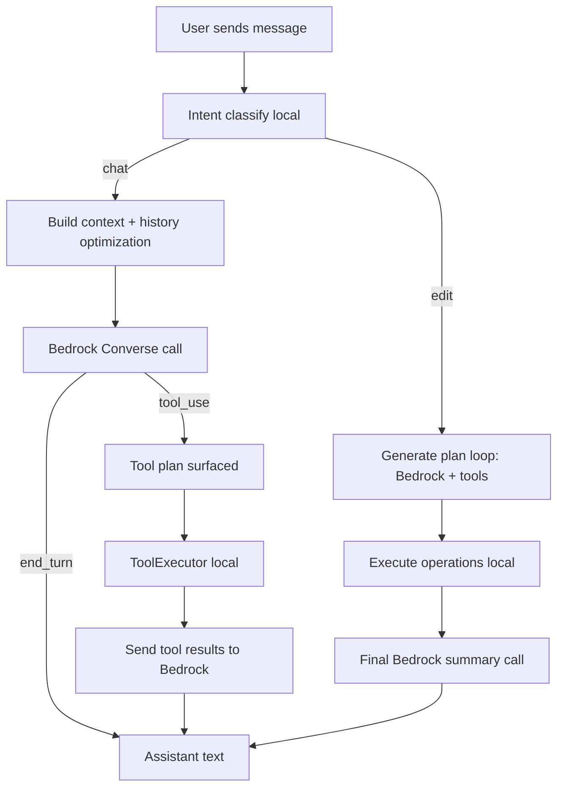
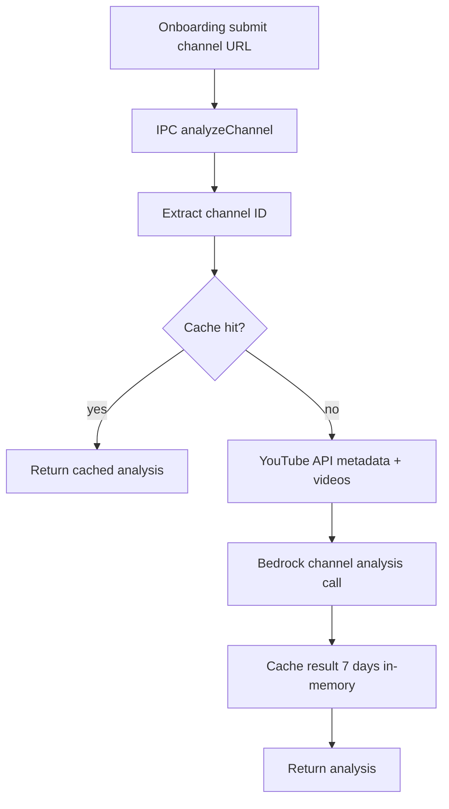
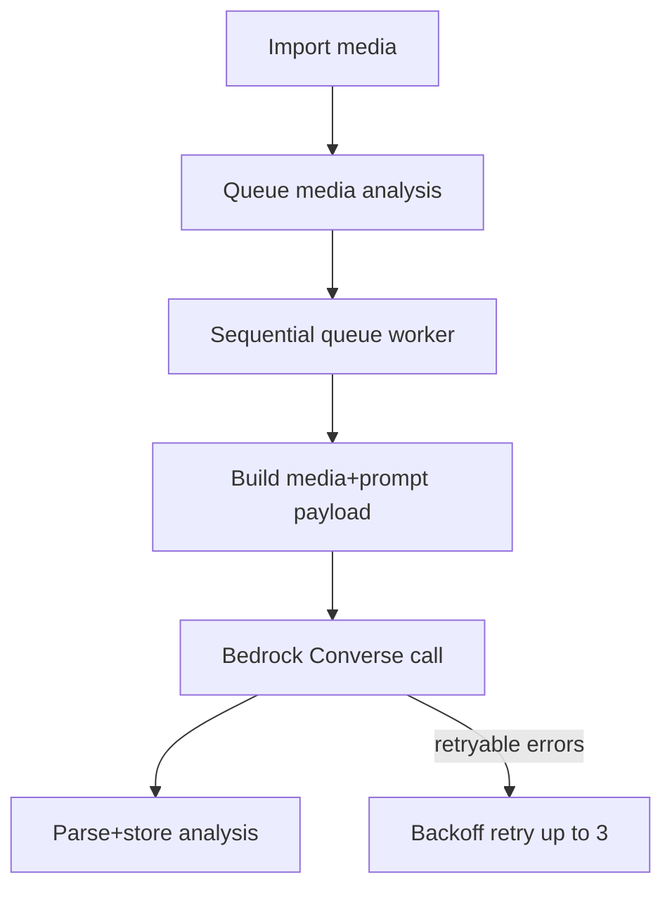

# AI Workflow & Cost Audit Report

## 1. Executive Summary
This project has multiple Bedrock-backed AI surfaces, not one unified path. The highest recurring costs come from chat planning/tool orchestration (`src/components/Chat/ChatPanel.tsx:82`, `src/lib/aiPlanningService.ts:119`), background media memory analysis (`src/components/FilePanel/MediaTab.tsx:137`, `src/lib/aiMemoryService.ts:511`), and caption fallback flows (`src/stores/useProjectStore.ts:841`, `src/lib/captioningService.ts:381`).

Key findings:
- Chat `stream` path is not token-streaming from Bedrock; it uses a single non-stream `ConverseCommand` and emits chunks locally (`src/lib/aiService.ts:482`, `src/lib/aiService.ts:556`).
- Edit intent can trigger multi-round planning + summary calls, with per-request Bedrock call counts up to `maxRounds + 1` (10 + 1 from caller config) (`src/components/Chat/ChatPanel.tsx:88`, `src/lib/aiPlanningService.ts:122`, `src/lib/aiPlanningService.ts:362`).
- Tool schema overhead is large (35 tools, ~24.7K chars source) and is injected on planning calls and some chat calls (`src/lib/videoEditingTools.ts`, `src/lib/aiService.ts:553`, `src/lib/aiPlanningService.ts:180`).
- Retry logic can duplicate billed calls in planning and memory analysis paths (`src/lib/rateLimiter.ts:193`, `src/lib/aiMemoryService.ts:272`).
- Cost telemetry is inconsistent between trackers (Bedrock pricing vs legacy AI pricing assumptions) (`src/lib/tokenTracker.ts:149`, `src/stores/useChatStore.ts:129`).

High-impact optimization direction:
- Reduce planning rounds and tool schema injection frequency.
- Make caching persistent where currently in-memory-only.
- Tighten context injection and cap planning-loop history growth.
- Unify cost telemetry and remove stale cached-token assumptions.

## 2. System Architecture Overview
Primary AI components:
- Renderer chat/orchestration: `src/components/Chat/ChatPanel.tsx`, `src/lib/aiService.ts`, `src/lib/aiPlanningService.ts`, `src/lib/intentClassifier.ts`, `src/lib/toolExecutor.ts`.
- Renderer background AI memory: `src/components/FilePanel/MediaTab.tsx`, `src/lib/aiMemoryService.ts`, `src/stores/useAiMemoryStore.ts`.
- Renderer captioning: `src/lib/captioningService.ts`, triggered by `src/stores/useProjectStore.ts:841` and `src/stores/useProjectStore.ts:934`.
- Electron onboarding/channel analysis: `electron/main.ts:352`, `electron/services/channelAnalysisService.ts`, `electron/services/aiAnalysisService.ts`, `electron/services/youtubeService.ts`, `electron/services/cacheService.ts`.
- Shared Bedrock client/config: `src/lib/bedrockClient.ts`.

Model usage in code:
- Default model ID: `amazon.nova-lite-v1:0` in renderer and main process (`src/lib/bedrockClient.ts:35`, `electron/main.ts:26`, `electron/services/aiAnalysisService.ts:51`).
- No fallback model chain implemented.

## 3. End-to-End Request Lifecycle
### 3.1 Chat Request Lifecycle (User Message)

Evidence:
- Intent route: `src/components/Chat/ChatPanel.tsx:67`.
- Chat path: `src/components/Chat/ChatPanel.tsx:160` -> `src/lib/aiService.ts:485`.
- Edit plan path: `src/components/Chat/ChatPanel.tsx:84` -> `src/lib/aiPlanningService.ts:119`.
- Tool execution path: `src/components/Chat/ChatPanel.tsx:299`, `src/lib/toolExecutor.ts:1292`.
- Plan execution final summary: `src/lib/aiPlanningService.ts:342`.

### 3.2 Onboarding Channel Analysis Lifecycle

Evidence:
- Onboarding trigger: `src/components/Onboarding/OnboardingWizard.tsx:32`.
- IPC handler: `electron/main.ts:352`.
- Orchestrator: `electron/services/channelAnalysisService.ts:62`.

### 3.3 Media Import Lifecycle (Background AI Memory)

Evidence:
- Import trigger: `src/components/FilePanel/MediaTab.tsx:92`, `src/components/FilePanel/MediaTab.tsx:154`.
- Queue and worker: `src/lib/aiMemoryService.ts:23`, `src/lib/aiMemoryService.ts:471`.

## 4. Detailed Cost Surface Mapping
### 4.1 Cost-Generating Operations
| Component | File | Trigger | Cost Type | Model/API | Call Count per Trigger |
|---|---|---|---|---|---|
| Chat summarization | `src/lib/aiService.ts:307` | History threshold exceeded | Bedrock tokens | Nova Lite | 0 or 1 extra |
| Chat response | `src/lib/aiService.ts:485` | Chat intent and fallback paths | Bedrock tokens | Nova Lite | 1 |
| Tool-result follow-up | `src/lib/aiService.ts:667` | User executes model-requested tools | Bedrock tokens | Nova Lite | 1 |
| Planning round | `src/lib/aiPlanningService.ts:175` | Edit intent | Bedrock tokens | Nova Lite | 1..maxRounds |
| Plan final summary | `src/lib/aiPlanningService.ts:362` | After plan execution | Bedrock tokens | Nova Lite | 1 |
| Memory analysis | `src/lib/aiMemoryService.ts:374` | Imported media queued | Bedrock tokens | Nova Lite | 1 (up to 3 on retry) |
| Caption refinement | `src/lib/captioningService.ts:184` | Local transcription succeeds | Bedrock tokens | Nova Lite | 1 |
| Caption from cached analysis | `src/lib/captioningService.ts:435` | Local fails, memory analysis exists | Bedrock tokens | Nova Lite | 1 |
| Direct video captioning | `src/lib/captioningService.ts:527` | Local fails, no cached analysis | Bedrock tokens | Nova Lite | 1 |
| Channel AI analysis | `electron/services/aiAnalysisService.ts:165` | Onboarding/profile analysis miss | Bedrock tokens | Nova Lite | 1 |
| YouTube metadata fetch | `electron/services/youtubeService.ts` | Channel analysis miss | External API quota/cost | YouTube Data API | 3+ calls |

### 4.2 Pricing Basis Used
From repository pricing reference `cost.md`:
- Nova Lite on-demand: input `$0.06/1M`, output `$0.24/1M` (`cost.md:68`, `cost.md:129`).
- Cache-read token discount appears in pricing reference but code does not implement Bedrock prompt cache APIs (`cost.md:15`, `src/lib/tokenTracker.ts:10`).

## 5. Tool Call Execution Analysis
Tool declarations:
- 35 tool specs defined (`src/lib/videoEditingTools.ts`; count from `toolSpec` declarations).
- Tool schema is injected in planning every round (`src/lib/aiPlanningService.ts:180`) and in chat only when `includeTools=true` (`src/lib/aiService.ts:550`).

Observed tool paths:
- Primary edit path: user -> `generateCompletePlan` (multi-round simulated tool results) -> `executePlan` (real local tool execution) -> one final Bedrock summary.
- Secondary tool path: chat call returns `tool_use` -> user approves -> local execute -> `sendToolResultsToAI`.

Cost implications:
- Planning loop includes schema + growing message history every round, so prompt tokens grow non-linearly.
- `ToolExecutor` itself is local (no external API cost), but every tool cycle that returns to model adds another Bedrock call.

Cycle map (secondary path):
`User -> Bedrock(chat) -> tool_use -> ToolExecutor(local) -> Bedrock(follow-up) -> response`

Cycle map (primary edit path):
`User -> Bedrock(planning round xN) -> local ToolExecutor(plan execution) -> Bedrock(summary) -> response`

## 6. Amazon Bedrock Usage Breakdown
Configuration and call settings:
- Shared renderer Bedrock client: `src/lib/bedrockClient.ts:29`.
- Temperature/top_p:
  - Chat/planning/summary mostly `temperature: 0.7`, `maxTokens: 4096` (`src/lib/aiService.ts:547`, `src/lib/aiPlanningService.ts:181`, `src/lib/aiPlanningService.ts:367`).
  - Summarization/refinement tasks use `temperature: 0.3` (`src/lib/aiService.ts:326`, `src/lib/captioningService.ts:193`, `src/lib/aiMemoryService.ts:384`).
- Streaming:
  - No Bedrock streaming API used in chat; `ConverseCommand` is non-streaming (`src/lib/aiService.ts:482`, `src/lib/aiService.ts:556`).
- Retry behavior:
  - Planning/summary retry once on throttling (`src/lib/rateLimiter.ts:193`, `src/lib/aiPlanningService.ts:175`).
  - Memory analysis retries up to 3 attempts on transient errors (`src/lib/aiMemoryService.ts:272`).

Findings:
- Same model used for trivial chat and complex planning; no tiered model routing.
- `maxTokens` defaults are high for many structured JSON tasks, encouraging oversized output ceilings.

## 7. Token Consumption Analysis
### 7.1 Major Token Drivers
- Static system prompts per call:
  - Chat system prompt ~2907 chars (~727 tokens) (`src/lib/aiService.ts`).
  - Planning system prompt ~2621 chars (~655 tokens) (`src/lib/aiPlanningService.ts`).
- Tool schema payload size:
  - `videoEditingTools.ts` ~24.7K chars source, substantial per-call overhead when attached.
- Dynamic context reinjection each call:
  - Timeline, channel analysis, and memory context often concatenated (`src/lib/aiService.ts:347`, `src/lib/aiPlanningService.ts:141`).
- Planning loop history accumulation:
  - Prior rounds and tool results are appended into subsequent rounds (`src/lib/aiPlanningService.ts:217`, `src/lib/aiPlanningService.ts:233`).

### 7.2 Token Waste Patterns
- Non-edit chat can still carry large context if classifier flags broad keywords (`src/lib/intentClassifier.ts:153`).
- Large media inline bytes are attempted even near/exceeding limits in some paths (`src/lib/aiService.ts:261`, `src/lib/captioningService.ts:494`).
- Legacy cost UI assumes cached input tokens and AI rates not aligned with current Bedrock tracker (`src/stores/useChatStore.ts:129`, `src/lib/tokenTracker.ts:149`).

## 8. Redundancy & Inefficiency Findings
### High Impact
- Planning-loop token amplification from iterative full-history re-send (`src/lib/aiPlanningService.ts:137`, `src/lib/aiPlanningService.ts:157`).
- Tool schema repeatedly sent for planning rounds and some chat calls (`src/lib/aiPlanningService.ts:180`, `src/lib/aiService.ts:553`).
- Retry paths may duplicate billable requests for memory analysis and throttled planning (`src/lib/aiMemoryService.ts:275`, `src/lib/rateLimiter.ts:217`).

### Medium Impact
- Chat “stream” is non-stream API call, reducing UX granularity without cost benefit (`src/lib/aiService.ts:482`).
- In-memory-only channel cache resets on app restart; repeated analyses can recur (`electron/services/cacheService.ts:11`).
- Telemetry mismatch risks bad optimization decisions:
  - UI session cost uses outdated AI pricing (`src/stores/useChatStore.ts:128`).
  - Tool-result metadata from follow-up calls is not consumed in one UI path (`src/components/Chat/ChatPanel.tsx:322`).

### Low Impact
- Branding/comments still refer to AI in multiple user-facing strings while backend is Bedrock, causing operational confusion.

## 9. Caching Opportunities
Current caching in code:
- Channel analysis cache (7 days) in-memory (`electron/services/cacheService.ts:124`).
- Memory analysis dedupe by `filePath` (`src/lib/aiMemoryService.ts:523`).
- Captioning cache-first path from existing memory analysis (`src/lib/captioningService.ts:395`).
- Media processing cache (thumbnail/waveform) local filesystem (`electron/utils/cache.ts`).

Recommended opportunities (architecture-level):
- Persistent channel-analysis cache (disk/DB): High impact. TTL 7-30 days by channel churn profile.
- Prompt-level response cache for deterministic structured tasks (channel analysis, summarize history): High impact. TTL 1-7 days keyed by normalized prompt hash + model version.
- Tool-read operation cache (`get_timeline_info`, `get_clip_details`) inside a request cycle: Medium impact. TTL request-scoped.
- Summarization memoization for unchanged history snapshots: Medium impact.
- Context block cache fragments (timeline snapshot hash, memory context hash): Medium impact.

## 10. Optimization Strategy
### Priority Plan
1. High: Constrain planning-loop rounds and payload growth
- Cap practical rounds by intent complexity class.
- Use compact round-state summaries instead of full prior transcripts.
- Expected savings: 25-40% on edit-intent costs.

2. High: Minimize tool schema transmission
- Attach only relevant tool subsets based on intent/entity extraction.
- Keep no-tool default for chat path strict.
- Expected savings: 10-25% on chat+planning prompt tokens.

3. High: Standardize and trust telemetry
- Align all UI cost dashboards with Bedrock rates and actual tracked usage.
- Remove cached-token assumptions unless Bedrock prompt cache is implemented.
- Expected savings: indirect but critical for avoiding false optimization.

4. Medium: Add persistent cache for onboarding channel analysis
- Prevent repeated YouTube + Bedrock calls across app restarts.
- Expected savings: high for repeated profiles/channels.

5. Medium: Tighten retry policy with idempotency-aware backoff
- Avoid duplicate expensive retries for large multimodal calls.
- Expected savings: 5-15% in failure-heavy environments.

6. Medium: Reduce max output token ceilings by task class
- Structured JSON calls can use lower `maxTokens` than 4096.
- Expected savings: 5-20% output-token reductions.

## 11. Projected Cost Reduction Model
### 11.1 Assumptions
- Pricing basis: Nova Lite on-demand from `cost.md` (`cost.md:129`, `cost.md:68`).
- Cost formula: `(input_tokens/1e6)*0.06 + (output_tokens/1e6)*0.24`.
- Token estimates are inferred from prompt structure and code paths; actuals vary with history/media.

### 11.2 Per-Request Estimated Cost (Current)
| Scenario | Estimated Input Tokens | Estimated Output Tokens | Estimated Cost |
|---|---:|---:|---:|
| Chat intent, no tools | 2,500 | 350 | $0.000234 |
| Chat + summarize pre-call | 8,500 total | 850 total | $0.000714 |
| Edit intent typical (3 planning rounds + summary) | 39,000 | 1,300 | $0.002652 |
| Edit intent worst-case (10 rounds + summary) | 120,000 | 5,000 | $0.008400 |
| Caption refine (text-only) | 12,000 | 1,200 | $0.001008 |
| Caption direct video fallback | 85,000 | 1,800 | $0.005532 |
| Channel analysis run | 5,000 | 900 | $0.000516 |
| Memory analysis (30s video estimate) | 8,700 | 800 | $0.000714 |

### 11.3 Monthly Projection Example
Assumed traffic: 100,000 chat/edit requests per month.
- Before optimization mix assumption: 75% simple chat, 20% edit-typical, 5% chat-with-summarize.
- Projected monthly cost: **$74.16**.

After optimization mix assumption (reduced planning payloads/rounds, tighter context/tool injection):
- 82% compact chat, 16% optimized edit, 2% summarized/other heavy.
- Projected monthly cost: **$40.95**.

Projected reduction: **44.8%** (model-driven workload only).

### 11.4 Worst-Case Monthly Envelope
If workload skews heavily to multi-round edit + direct video caption fallback + retries, monthly costs can exceed the baseline model by 3-6x depending on average media duration and retry frequency.

## 12. Final Recommendations
- High: Make planning bounded and state-compact; avoid full-history resend across rounds.
- High: Reduce tool schema scope dynamically; keep no-tool chat strict.
- High: Unify and correct cost telemetry (Bedrock rates only, remove stale cached-token logic).
- Medium: Persist channel-analysis cache beyond process lifetime.
- Medium: Apply task-class-specific token ceilings and stricter output contracts.
- Medium: Add explicit cost guardrails per request type (chat, plan, caption, memory).
- Low: Clean up AI-era naming/comments to prevent operational misconfiguration.

---
Prepared from code inspection of renderer + Electron flows, with pricing basis from repository reference file `cost.md`.
